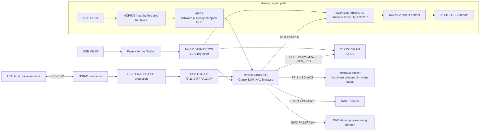
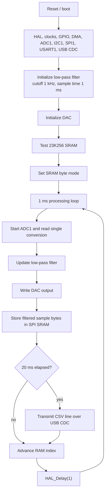

# APOLLO Digital Signal Processor

APOLLO DSP is a USB-powered STM32F401 signal-processing board with a KiCad
hardware design and STM32CubeIDE firmware. The firmware is structured around an
analog processing loop that samples an input, applies a simple first-order
low-pass filter, drives an external I2C DAC, streams CSV-style telemetry over
USB CDC, and writes filtered sample data to an external SPI SRAM.

## Repository Layout

| Path | Purpose |
| --- | --- |
| `Apollo - DSP.kicad_pro` | Main KiCad project file. |
| `Apollo - DSP.kicad_sch` | Top-level schematic with USB-C, power entry, protection, regulators, and sheet links. |
| `DSP.kicad_sch` | Digital sheet with the STM32F401RBTx, clock, SWD/UART headers, 23K256 SRAM, and SD-card connector. |
| `Analog.kicad_sch` | Analog sheet with MCP602 op-amp stages, analog connectors, and the MCP4725-family DAC symbol. |
| `Apollo - DSP.kicad_pcb` | Routed PCB layout. |
| `Gerber/` | Fabrication exports, drill files, and Gerber job file. |
| `pictures/` | Board render/export images used by this README. |
| `datasheets/` | Local component datasheets and reference documents. |
| `Software/Apollo - DSP/` | STM32CubeIDE firmware project. |

## Architecture Overview

## Hardware Summary

- MCU: STM32F401RBTx in LQFP64, configured for an 84 MHz system clock from a
  16 MHz HSE crystal.
- USB: USB-C receptacle, USBLC6-2SC6 ESD protection, and USB OTG FS routed to
  the STM32 device controller.
- Power: USB VBUS input, fuse/ferrite filtering, NCP115ASN330T2G 3.3 V LDO, and
  separate analog supply labels such as `+5VA` and `VAA`.
- Analog path: two analog input labels (`AIN0`, `AIN1`), MCP602 op-amp
  conditioning stages, an I2C DAC output path, and analog output labels
  (`AOUT`, `OSC`).
- Memory and storage: 23K256 SPI SRAM plus a microSD connector wired to the SPI
  bus through a separate chip-select net.
- Debug and expansion: SWD, USART1, test points, and pin headers are present in
  the digital schematic.

## Firmware Summary

The firmware project in `Software/Apollo - DSP/` was generated with
STM32CubeMX/STM32CubeIDE for STM32Cube FW_F4 V1.27.1. Application code lives in
`Core/Src` and `Core/Inc`; generated HAL, CMSIS, USB Device, and middleware code
is kept alongside it.

Important application files:

| File | Role |
| --- | --- |
| `Core/Src/main.c` | Peripheral initialization and main processing loop. |
| `Core/Src/filter.c` / `Core/Inc/filter.h` | First-order low-pass and high-pass filter helpers. |
| `Core/Src/MCP4726.c` / `Core/Inc/MCP4726.h` | I2C DAC initialization and write helpers. |
| `Core/Src/23K256.c` / `Core/Inc/23K256.h` | SPI SRAM mode, test, read, and write helpers. |
| `Core/Src/microprint.c` / `Core/Inc/microprint.h` | Convenience USB CDC print helpers. |
| `Core/Src/SDCARD.c` / `Core/Inc/SDCARD.h` | SD-card API placeholders. |
| `USB_DEVICE/App/usbd_cdc_if.c` | USB CDC transmit/receive interface. |
| `Apollo - DSP.ioc` | CubeMX peripheral and pin configuration. |

### Main Loop

Current source status:

- The CubeMX configuration enables ADC1, DMA2 Stream0, I2C1, SPI1, USART1, USB
  Device CDC, and USB OTG FS.
- `main.c` uses blocking ADC polling rather than the configured ADC DMA path.
- The hardware has labels for ADC channel 0 and channel 1, but the firmware
  currently configures a single regular conversion on `ADC_CHANNEL_0`.
- `SDCARD.c` contains placeholder no-op functions; the SD-card interface is not
  implemented in firmware yet.
- The DAC schematic symbol is MCP4725-family, while the firmware driver files
  are named `MCP4726.*`.

## Peripheral Map

| Peripheral | Pins / Nets | Current use |
| --- | --- | --- |
| ADC1 | `PA0` / `ADC_CH0_IN`, `PA1` / `ADC_CH1_IN` | Firmware samples ADC channel 0. |
| I2C1 | `PB6` SCL, `PB7` SDA | External DAC control. |
| SPI1 | `PA5` SCK, `PA6` MISO, `PA7` MOSI | External SRAM and SD-card connector. |
| USB OTG FS | `PA11` DM, `PA12` DP | USB CDC virtual COM port. |
| USART1 | `PA9` TX, `PA10` RX | UART header. |
| SWD | `PA13` SWDIO, `PA14` SWCLK | Programming and debug. |
| HSE | `PH0`, `PH1` | 16 MHz crystal input. |

## Opening and Building

### Hardware

1. Open `Apollo - DSP.kicad_pro` in KiCad.
2. Use `Apollo - DSP.kicad_sch`, `DSP.kicad_sch`, and `Analog.kicad_sch` for
   schematic review.
3. Use `Apollo - DSP.kicad_pcb` for board layout review.
4. Use the files in `Gerber/` for fabrication output.

### Firmware

1. Open or import `Software/Apollo - DSP/` in STM32CubeIDE.
2. Review or regenerate configuration from `Apollo - DSP.ioc` if peripherals or
   pins change.
3. Build the Debug or Release configuration from STM32CubeIDE.
4. Flash/debug through the SWD header using the included CubeIDE launch/debug
   configuration as a starting point.

The generated `Debug/` and `Release/` folders contain object files, maps, lists,
and ELF outputs from previous builds. The checked-in generated makefiles use the
repository linker script path, but command-line builds still require the
`arm-none-eabi` GCC toolchain to be available on `PATH`.
