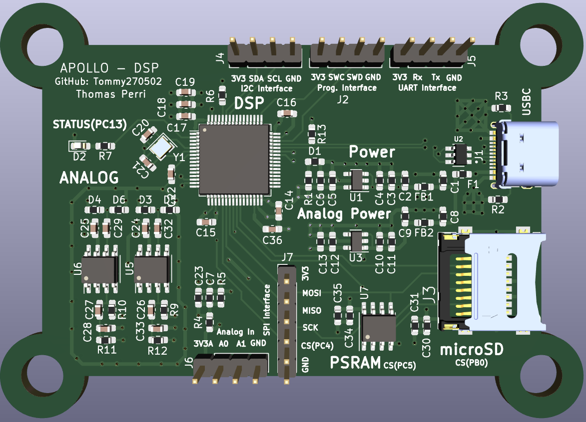
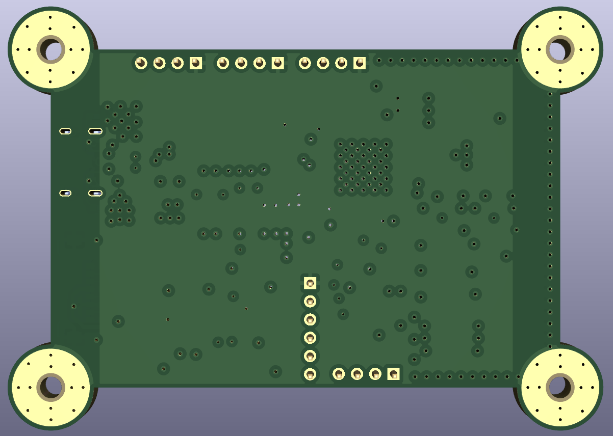
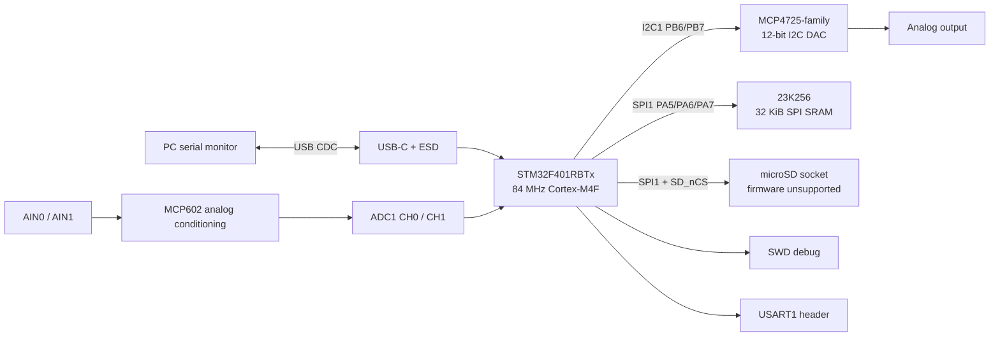
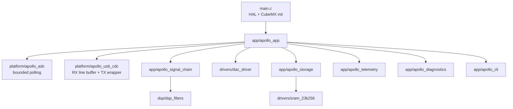
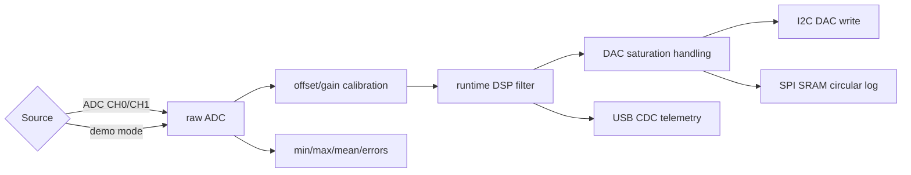

# APOLLO Digital Signal Processor

APOLLO is a USB-powered STM32F401 digital signal-processing board and firmware
case study. The repository combines KiCad hardware design, STM32CubeIDE
firmware, external analog and memory devices, host-side tests for reusable C
logic, and validation notes for hardware-dependent behavior.




## What This Demonstrates

- STM32F401 firmware architecture with CubeMX-generated code kept separate from
  hand-written application logic.
- USB CDC command and telemetry interface for live DSP configuration.
- Two-channel analog input support, external I2C DAC output, and SPI SRAM
  circular sample logging.
- Embedded-friendly DSP filters with fixed buffers and parameter validation.
- Clear distinction between implemented, host-tested, and hardware-validation
  required features.

## System Overview



## Firmware Architecture



`main.c` now performs HAL initialization, CubeMX peripheral initialization, and
then calls `apollo_app_init()` and `apollo_app_task()`. Application behavior is
kept under `Software/Apollo - DSP/Core/Inc/*` and
`Software/Apollo - DSP/Core/Src/*`.

## Signal Pipeline



Default firmware behavior preserves the original demo path: ADC channel 0 is
sampled, a 1 kHz first-order low-pass filter is applied, the result is written
to the external DAC, telemetry is streamed over USB CDC, and compact sample
records are written to external SRAM when the SRAM self-test passes.

## USB Commands

Commands are sent over the USB CDC virtual COM port with newline termination.

| Command | Purpose |
| --- | --- |
| `help` | Print command summary. |
| `status` | Print sample count, channel, filter, demo, calibration, storage, and error counters. |
| `filter bypass` | Disable filtering. |
| `filter lowpass <hz>` | First-order low-pass IIR. |
| `filter highpass <hz>` | First-order high-pass IIR. |
| `filter ema <alpha>` | Exponential moving average, `0 < alpha <= 1`. |
| `filter average <n>` | Moving average, up to 16 samples. |
| `filter median <n>` | Median filter, up to 9 samples. |
| `input 0` / `input 1` | Select ADC channel 0 or 1. |
| `demo off\|sine\|step\|impulse` | Use real ADC input or synthetic samples. |
| `telemetry on\|off` | Enable or disable periodic telemetry frames. |
| `calibrate clear` | Restore unity ADC/DAC scaling. |
| `calibrate adc <gain> <offset>` | Set ADC input calibration (gain 0.01-100, offset +/-4095). |
| `calibrate dac <gain> <offset>` | Set DAC output calibration (gain 0.01-100, offset +/-4095). |

## Telemetry

Sample frames use this CSV format:

```text
T,timestamp_ms,sequence,channel,raw_adc,filtered,dac_code,filter,flags
```

Example:

```text
T,1200,57,0,1820,1784.42,1784,lowpass,0x00000000
```

Flags report clipping, demo source, filter errors, ADC errors, DAC errors, and
SRAM logging errors.

## Repository Layout

| Path | Purpose |
| --- | --- |
| `Apollo - DSP.kicad_pro` | Main KiCad project. |
| `Apollo - DSP.kicad_sch`, `Analog.kicad_sch`, `DSP.kicad_sch` | Hardware schematics. |
| `Apollo - DSP.kicad_pcb` | PCB layout. |
| `Gerber/` | Fabrication outputs. |
| `pictures/` | Board images. |
| `datasheets/` | Local component datasheets. |
| `Software/Apollo - DSP/` | STM32CubeIDE firmware project. |
| `tests/host/` | Host-buildable tests for pure C logic. |
| `docs/` | Technical documentation and validation notes. |

See [REPOSITORY_STRUCTURE.md](REPOSITORY_STRUCTURE.md) for more detail.

## Build And Flash

1. Open STM32CubeIDE.
2. Import `Software/Apollo - DSP/` as an existing STM32CubeIDE project.
3. Build the Debug or Release configuration.
4. Flash/debug over the SWD header using an ST-LINK compatible probe.
5. Open the USB CDC virtual COM port with a serial terminal.
6. Send `help`, `status`, or `demo sine` to verify the command path.

Generated `Debug/` and `Release/` folders are intentionally not tracked.
STM32CubeIDE regenerates them locally.

## Host Tests

Host tests cover pure logic that does not require STM32 HAL or board hardware:

```sh
make -C tests/host test
```

The tests exercise DSP filter behavior, command parsing, telemetry formatting,
diagnostics, calibration/clipping math, and signal-chain demo paths.

## Validation Status

- Host tests pass on Windows 11 / MSYS2 / GCC 15.2.0 (2026-05-27).
- Firmware Debug and Release builds pass with 0 errors (STM32CubeIDE 2.0.0,
  arm-none-eabi-gcc 14.3.1, 2026-05-27).
- Hardware-dependent behavior requires board validation:
  ADC channel accuracy, DAC output voltage, SRAM SPI timing, and USB behavior
  under sustained traffic.
- microSD hardware is present, but firmware support is explicitly unsupported
  until a real SPI block-device and filesystem implementation is added.

See [docs/validation.md](docs/validation.md) for the full validation checklist.

## Engineering Highlights

- CubeMX-generated code is preserved and hand-written application code is moved
  into reviewable modules.
- Peripheral failures no longer force infinite retry loops in application code.
- Runtime filter selection and demo sources make the board demonstrable without
  external analog equipment.
- Documentation states validation limits instead of claiming untested hardware
  support.

## Future Work

- Move ADC acquisition to timer-triggered DMA with overrun accounting.
- Add real microSD support using a validated SPI block-device layer and FatFs.
- Add fixture-based hardware tests for DAC linearity, ADC channel calibration,
  SRAM retention, and USB throughput.
- Add optional firmware CI if a reproducible STM32 toolchain image is adopted.
