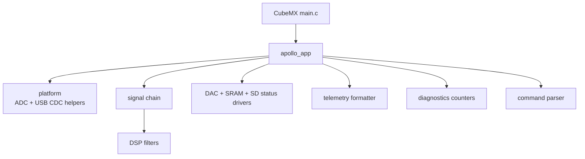
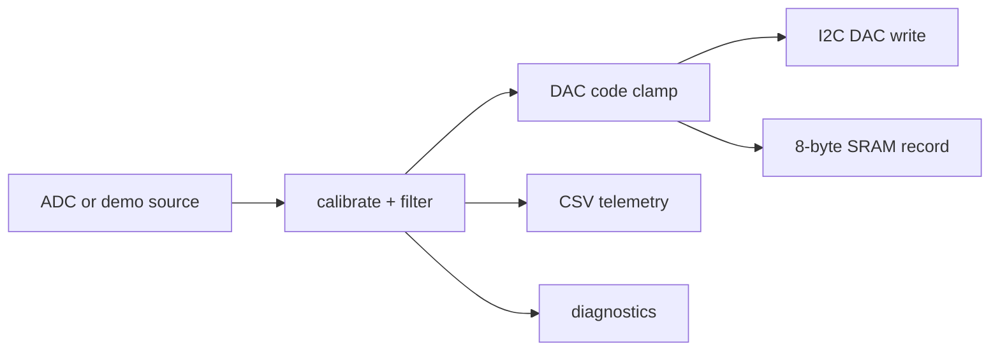

# Architecture

APOLLO separates generated STM32CubeIDE infrastructure from hand-written
application firmware. CubeMX owns peripheral setup in `main.c`, MSP files, USB
device glue, HAL, CMSIS, and middleware. Application code lives below
`Core/Inc/app`, `Core/Inc/dsp`, `Core/Inc/drivers`, and `Core/Inc/platform`
with matching source folders.

The main runtime path is tick scheduled. ADC polling is still used in this
cleanup pass, but it is bounded and isolated in `platform/apollo_adc.c` so a
future timer/DMA implementation can replace it without rewriting the signal
chain.

## Data Flow

The SRAM record format is little-endian:

| Offset | Type | Field |
| --- | --- | --- |
| 0 | `uint32_t` | timestamp in milliseconds |
| 4 | `uint16_t` | raw ADC code |
| 6 | `uint16_t` | DAC code |
