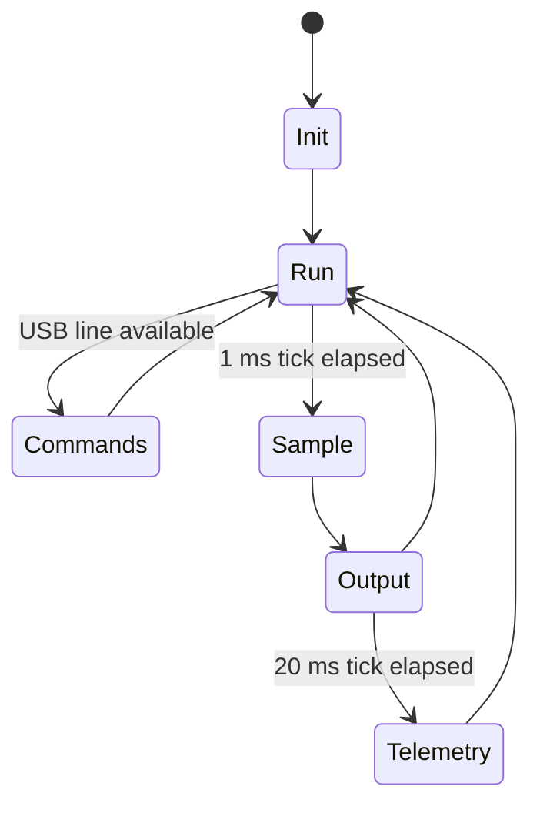

# Firmware

The firmware targets an STM32F401RBTx and is maintained as an STM32CubeIDE
project in `Software/Apollo - DSP/`.

## Responsibilities

| Module | Responsibility |
| --- | --- |
| `app/apollo_app` | Runtime orchestration, scheduling, command execution, and error accounting. |
| `app/apollo_signal_chain` | Calibration, filtering, demo sources, DAC clipping, and sample frame creation. |
| `app/apollo_cli` | Minimal USB CDC command parser. |
| `app/apollo_telemetry` | CSV telemetry and status formatting. |
| `app/apollo_storage` | SRAM circular sample logging. |
| `dsp/dsp_filters` | Reusable fixed-buffer DSP filters. |
| `drivers/dac_driver` | MCP4725-family 12-bit I2C DAC writes. |
| `drivers/sram_23k256` | 23K256 SPI SRAM mode, test, read, and write operations. |
| `drivers/sd_card` | Explicit unsupported status for microSD firmware support. |
| `platform/apollo_adc` | Bounded ADC polling and channel selection. |
| `platform/apollo_usb_cdc` | USB CDC RX line buffering and TX status mapping. |

## Runtime Loop

## Current Timing Choice

The project still uses ADC polling rather than timer-triggered DMA. The polling
is bounded by `APOLLO_ADC_TIMEOUT_MS` and hidden behind `apollo_adc_read()`.
That preserves current behavior while making the future DMA migration localized.
